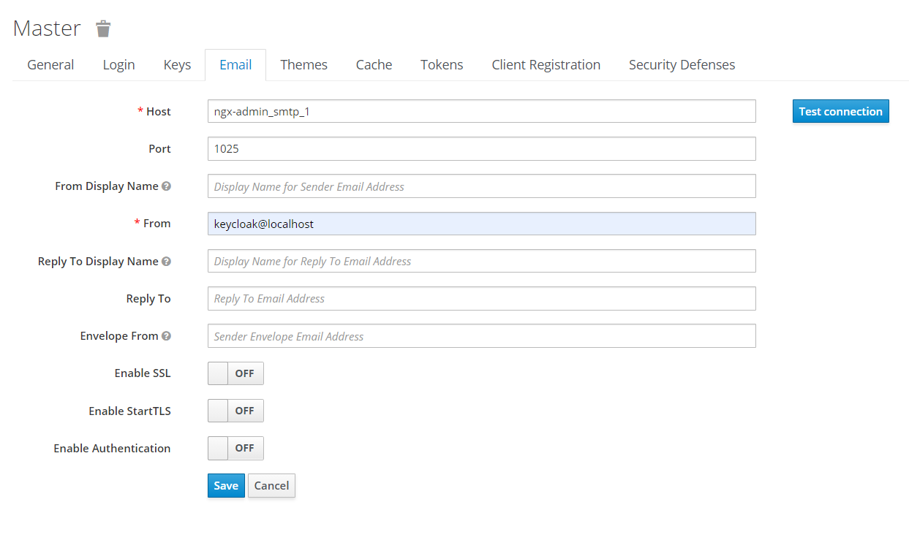

# ngx-admin based cloud platform GUI [](https://hubs.ly/H0n4ZDy0)

Website based on ngx-admin, inspired by [DigitalOcean's Platform](https://digitalocean.com)  

- [Link to ngx-admin](https://github.com/akveo/ngx-admin)  
- [Documentation](https://hubs.ly/H0n4Sfq0)  
- [Installation Guidelines](https://hubs.ly/H0n4Svc0)  


## Check it out
```sh
npm install
npm run start
```

## Keycloak Mail Config
* get name of mailhog container
```sh
docker ps -a
CONTAINER ID        IMAGE               COMMAND                  CREATED             STATUS              PORTS                              NAMES
60a4f04da5c6        jboss/keycloak      "/opt/jboss/tools/do…"   8 minutes ago       Up 8 minutes        0.0.0.0:8080->8080/tcp, 8443/tcp   ngx-admin_keycloak_1
d9e23577d44c        mailhog/mailhog     "MailHog"                8 minutes ago       Up 8 minutes        1025/tcp, 0.0.0.0:8025->8025/tcp   ngx-admin_smtp_1
```
